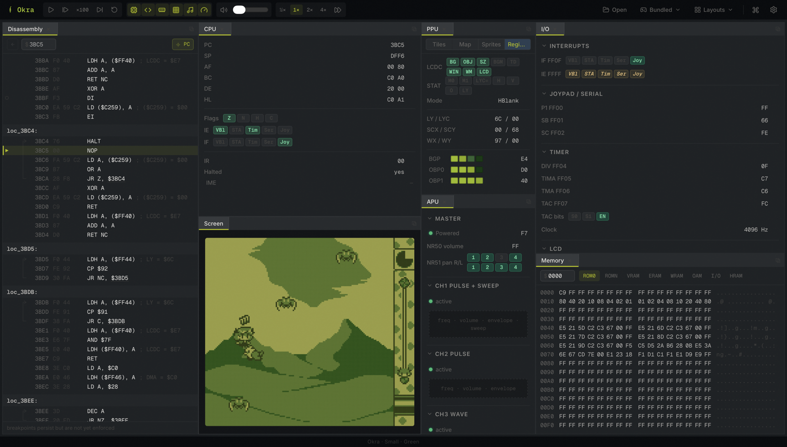

<div align="center">

# Okra

**A Game Boy (DMG) emulator written in Rust, with a built-in debugger.**

[**Try it in the browser →**](https://anjin-byte.github.io/okra-emu/)

</div>

[](https://anjin-byte.github.io/okra-emu/)

It runs in the browser via WebAssembly, and the debugger lets you poke at a running game — disassembly, CPU and PPU registers, and memory.

## Status

A personal project and a work in progress. The core is reasonably accurate — it passes Blargg's `cpu_instrs` and most of the timing tests — but there are rough edges: a couple of timing cases still fail (see [Accuracy](#accuracy)), the debugger's breakpoints aren't enforced yet, and the desktop build is older than the web one.

## Running it

The [demo](https://anjin-byte.github.io/okra-emu/) is the easiest way to try it — it bundles a boot ROM and a demo game. Building locally needs [Rust](https://rustup.rs/) (with the `wasm32-unknown-unknown` target), [`wasm-pack`](https://rustwasm.github.io/wasm-pack/), and [Node](https://nodejs.org/) 20+.

```bash
make web     # build the WASM core and start the dev server
make test    # run the test suites

# or run a ROM headless, from the command line:
cargo run --release -p fragile-canvas -- path/to/rom.gb
```

## How the CPU works

The SM83 is modeled one cycle at a time: each instruction decodes into a short sequence of primitive steps — register loads, ALU ops, memory reads and writes, flag updates — and the CPU runs one step per cycle. The fiddly memory- and interrupt-timing behavior mostly falls out of that instead of being special-cased per opcode.

The DMG runs off a single 2²² Hz clock, and every other timing divider is a power-of-two shift from it, so the emulator ticks at that resolution and keeps time with an integer accumulator (no drift).

## Layout

```
sm83/        emulator core — CPU, PPU, APU, memory, timers
sm83-isa/    assembler and disassembler
cli/         headless command-line runner
wasm/        WebAssembly bindings for the browser
web/         the browser app (Vite + Svelte) — what the demo deploys
ui/, phi/    shared Svelte UI and its components
desktop/     a Tauri desktop build (older; runs the plain player, not the debugger)
```

## Accuracy

Checked against [Blargg's test ROMs](https://github.com/c-sp/game-boy-test-roms):

| Suite | Result |
| :-- | :-- |
| `cpu_instrs` | 11 / 11 |
| `instr_timing`, `mem_timing`, `mem_timing2` | pass |
| `halt_bug`, `interrupt_time` | failing |

```bash
cargo test -p sm83 --test blargg
```

## Contributing

Bug reports and pull requests are welcome — see [CONTRIBUTING.md](CONTRIBUTING.md).

## License

[MIT](LICENSE).

The bundled demo game, **Tobu Tobu Girl Deluxe**, is © [Tangram Games](https://tangramgames.dk/tobutobugirl/) / [Simon Larsen](https://github.com/SimonLarsen) — code MIT, assets [CC BY 4.0](https://creativecommons.org/licenses/by/4.0/); if you enjoy it, support the creators. Hardware behavior was checked against the [Pandocs](https://gbdev.io/pandocs/).
